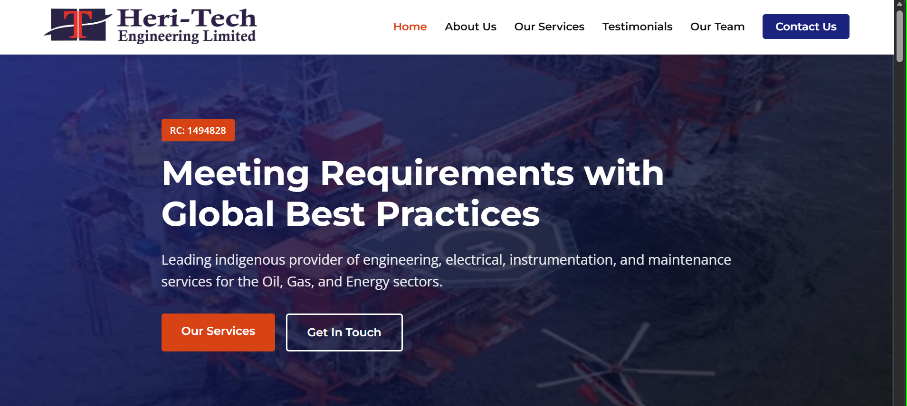
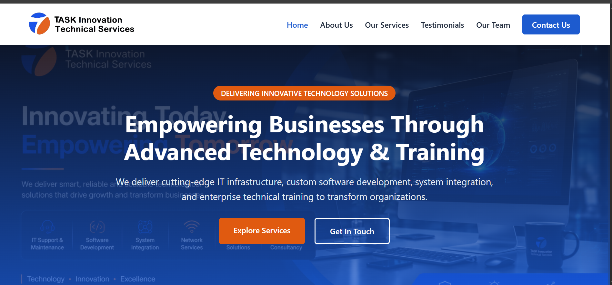

# Hi there, I'm Flora! 👋
### Industrial Technical Trainer | Project & Operations Facilitator | QHSE & Quality Specialist

I design and facilitate high-impact technical training, process engineering workflows, and digital transformation programs for corporate enterprises, engineering teams, and industrial operations.

---

## 🛠️ Industrial & Technical Expertise

* **Corporate Technical Facilitation:** Process Optimization, Project Lifecycle Management, Industrial Workflow Training.
* **Quality & Safety Management:** Quality Assurance / Quality Control (QA/QC), Quality Management Systems (ISO 9001 Alignment), Integrated QHSE Frameworks.
* **Software & Web Engineering:** Web Architecture (HTML5, CSS3, JavaScript), Python Systems Development, Database Administration (PostgreSQL), Version Control Systems (Git/GitHub).

---

## 🏗️ Industrial Training & Engineering Projects

### 1. Enterprise Engineering & Operations Portal

* **Overview:** Production-ready web platform built for Heri-Tech Engineering Limited, showcasing indigenous oilfield services, electrical & instrumentation, bolt tensioning, and NDT inspection capabilities.
* **Role:** Lead Technical Developer & Industrial Curriculum Architect.
* **Key Focus:** Translating complex industrial engineering workflows into responsive, enterprise-grade digital architecture.
* 🔗 [View Repository](https://github.com/nkem2025/heritech-engineering-capstone)

---

### 2. Corporate Tech Solutions & Software Systems Architecture

* **Overview:** Full-stack enterprise web design and development framework engineered to train corporate tech leads and junior engineers.
* **Role:** Lead Instructor & Process Specialist.
* **Key Focus:** Modern UI/UX layout design, dynamic DOM handling, structured data access patterns, and automated front-end validation.

---

## 📊 Core Facilitation Competencies

| Domain | Corporate Focus & Industry Impact |
| :--- | :--- |
| **Project Lead Training** | Agile project tracking, operational milestone management, cross-functional team workflows. |
| **QA/QC Systems** | Document control processes, quality assurance frameworks, ISO compliance guidelines. |
| **QHSE Integration** | Workplace safety procedures, hazard communication, environmental compliance processes. |
| **Process Instruction** | Converting technical engineering documentation into scalable corporate training systems. |

---

## 💼 Connect & Professional Inquiries

* **LinkedIn:** [flora-agubolom/05ab2963]
* **Professional Email:** [fnkem.2014@gmail.com]
* **Location:** Port Harcourt, Rivers State, Nigeria 🇳🇬 *(Open to local, hybrid, and international remote engagements)*

*“Transforming complex data and safety logic into clear, maintainable code and scalable curriculum architecture.”*

