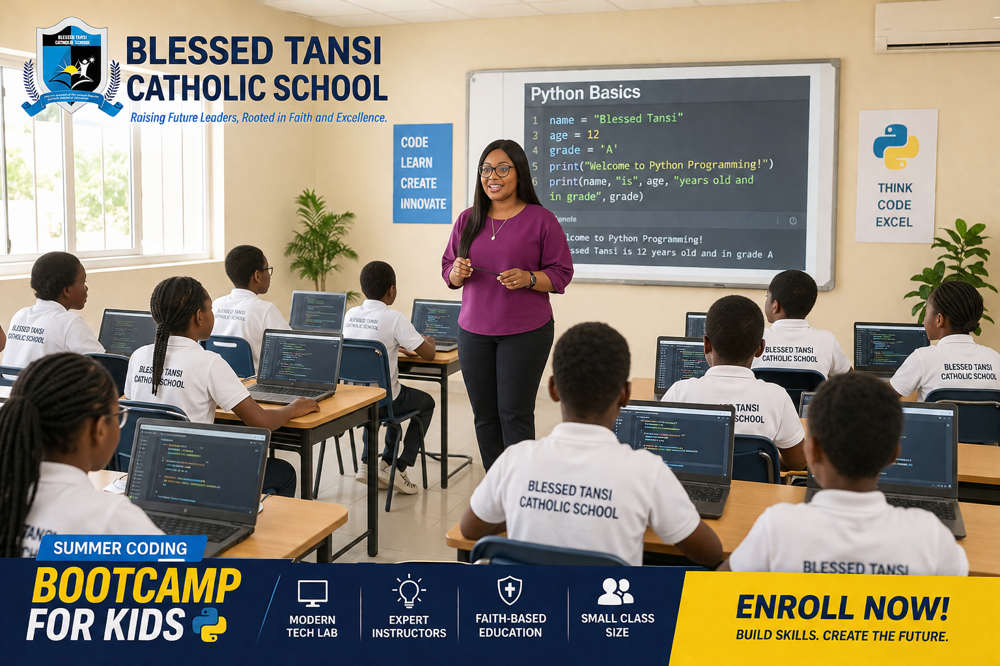

# Hi there, I'm Flora! 👋

### Senior Tech Instructor | Python Developer | QHSE & Corporate Training Professional

With over 9 years of international leadership experience across high-stakes industries, I specialize in bridging the gap between rigorous enterprise frameworks and modern software development engineering. I leverage an extensive background in document control architectures, international auditing, compliance systems, and industrial workforce instruction to develop, structure, and teach highly scalable technical applications.

---

## 🚀 Core Competencies & Technical Superpowers

* **Software Development Engineering:** Advanced Python (Tkinter, Pygame UI frameworks, Script Compiling), PostgreSQL Databases, Git Workflow Architectures.
* **Instructional Program Architecture:** Technical Curriculum Architecture, Multi-threaded Accessible Learning Systems, Gamified Classroom Assessment Projects.

* *Beyond crafting the visual identity and structural infographics for these educational campaigns, I personally design the curriculum and serve as the lead instructor—directly tutoring pupils in computer literacy, Scratch creative workflows, and text-based Python programming.*

<!-- ACCURATE INSTRUCTIONAL PORTFOLIO GRID -->
<table border="0" width="100%">
  <!-- ROW 1: Bootcamp Classroom (Left) & Scratch Projects (Right) -->
  <tr>
    <td width="50%" valign="top" align="center">
      <strong>🖥️ Live Classroom Instruction: Python Bootcamp</strong>  
      
      
<em>Directly tutoring and engaging pupils on core Python programming structures inside the modern tech lab at Blessed Tansi Catholic School, cultivating logical thinking and early hands-on development skills.</em>

    </td>
    <td width="50%" rowspan="2" valign="top" align="center" style="padding-left: 10px;">
      <strong>🎵 K-12 Scratch Creative Coding Curriculum</strong>  
      
      
<em>A progressive audio-logic framework I developed to guide young learners. Takes pupils step-by-step from primary animal sound scripts up to high-school DJ Party Mixer projects using event broadcasting blocks.</em>

    </td>
  </tr>
  
  <!-- ROW 2: Tutoring Advert (Left) -->
  <tr>
    <td width="50%" valign="top" align="center">
       
 
      <strong>🎯 Professional IT Tutoring Services</strong>  
      
      
<em>Leading specialized, multi-disciplinary IT tutoring programs under TASK Innovation Technical Services, covering core tracks from Web Design & Development to Advanced Excel and Data Management.</em>

    </td>
  </tr>
  
  <!-- ROW 3: Summer Splash (Left) & Global Skills Academy (Right) -->
  <tr>
    <td width="50%" valign="top" align="center">
       
 
      <strong>🏖️ Holiday Summer Splash (Computer & Coding)</strong>  
      
      
<em>Managing and leading the computer studies and coding classes for pupils during the Blessed Tansi Catholic School Summer Splash, introducing young minds to critical digital skills and logic formatting.</em>

    </td>
    <td width="50%" valign="top" align="center" style="padding-left: 10px;">
       
 
      <strong>🚀 Global Digital Skills Academy Roadmap</strong>  
      
      
<em>An educational roadmap designed for TASK Innovation to transition students seamlessly from introductory block-based programming interfaces to professional, text-based Python software development environments.</em>

    </td>
  </tr>
</table>
* **Enterprise Process Operations:** 9+ Years International QHSE Management Systems, Strict Document Control Controls, Risk Assessment Metrics, ISO Certifications, Regulatory Compliance Auditing.

---

## 💻 Featured Technical Portfolio Projects

### 🎙️ 1. Smart Talking Quiz Application
An accessible, highly responsive desktop training engine built to leverage automated text-to-speech synthesis for multi-sensory educational learning paths.
* [🎙️ Smart Talking Quiz Suite](https://github.com/nkem2025/interactive-learning--apps/tree/main/smart-talking-quiz) – Text-to-speech multi-threaded desktop application.
* **Tech Stack:** Python, Tkinter GUI, `gTTS` API, `Pygame.mixer`, Multi-threading execution logic.
* **Architecture Highlights:** Solved UI-freeze anomalies by shifting ongoing audio compilation and playback entirely into standalone background engine threads; engineered systemic asset managers to cleanly initialize, execute, and erase runtime dependencies on the fly.

### 🧮 2. Gamified Multiplication Assessment & Certificate Engine
A complete student-centric math utility suite transitioning traditional academic evaluation processes away from standard paper matrices into modern high-engagement software ecosystems.
* [🧮 Multiplication Quiz Challenge](https://github.com/nkem2025/interactive-learning--apps/tree/main/multiplication-quiz-challenge) – Gamified math application with custom logo assets and reporting.
* **Tech Stack:** Python, Random Matrix Generation, Audio Event-Handling Layers, automated Pillow (PIL) certificate compilers.
* **Pedagogical Blueprint:** Spearheaded instructional workflows from raw proof-of-concept modeling to finalized stand-alone distribution packages.

### 🏥 3. Advanced CBT Examination Platforms & State Testing Suites
Highly functional, JAMB-simulated desktop examination tools featuring modern multi-screen layouts, independent running background timers, and responsive user states.
* [🗺️ Nigeria States & Capitals Challenge](https://github.com/nkem2025/interactive-learning--apps/tree/main/nigeria-states-quiz) – Lightweight dynamic dictionary application tracking regional capitals.
* **Tech Stack:** Python, Tkinter View Engines (`.tkraise()`), Layered UI Frames, Event Loop Hooks (`root.after`).
* **Engineering Architecture:** Built state-aware dynamic dashboards tracking progress using algorithmic color-coding indicators (Active, Complete, Unattempted), backed by modular dictionary dataset arrays.

---

## 📊 Professional Background Highlights (Oil & Gas Leadership)

* **Process Architecture & Audits:** Managed international safety management architectures, ensuring continuous operational conformity with multi-layered statutory standards.
* **Document Control Systems:** Designed, structured, and audited mission-critical enterprise technical data indices—applying the exact organizational philosophies that drive clear software revision architectures today.
* **Workforce Optimization Training:** Orchestrated high-level technical competencies and complex regulatory instructional seminars for professional personnel inside high-consequence corporate landscapes.

---

## 📬 Connect With Me

* **LinkedIn:** [flora-agubolom/05ab2963]
* **Professional Email:** [fnkem.2014@gmail.com]
* **Location:** Port Harcourt, Rivers State, Nigeria 🇳🇬 *(Open to local, hybrid, and international remote engagements)*

*“Transforming complex data and safety logic into clear, maintainable code and scalable curriculum architecture.”*

